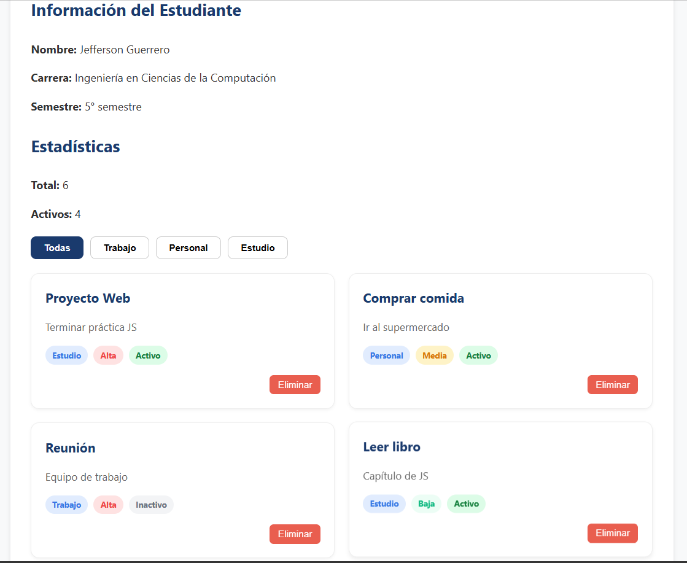
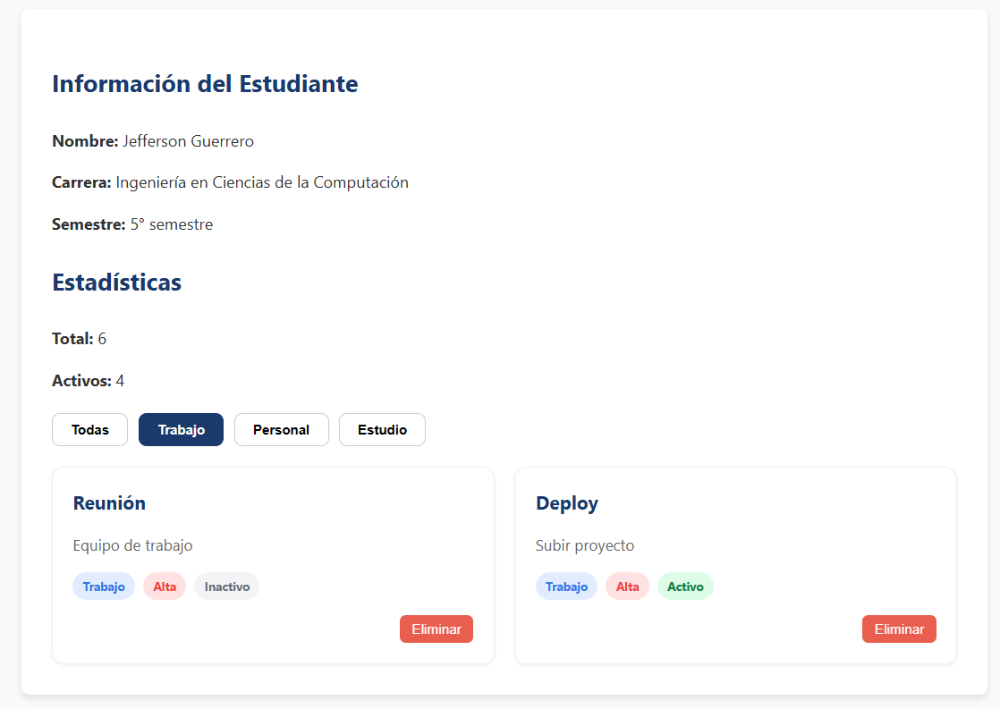

# **PRACTICA 02: DOM-BASICO**
Los estilos aplicados en CSS para conseguir que la práctica sea lo más parecida a la imagen referencial, ha sido el uso de un diseño responsivo, el cuál permite que las tarjetas se ajusten de manera automática al tamaño de la ventana/pantalla. Además, se utilizaron colores y etiquetas redondeadas para que el usuario pueda reconocer la prioridad y el estado de cada elemento. También, se añadieron efectos visuales suaves, como sombras y movimientos al pasar el ratón, con el objetivo de que la navegación sea intiutiva.

## Código CSS
```css
:root {
    --primary-color: #1a3a6d;
    --danger-color: #e74c3c;
    --bg-light: #f8f9fa;
    --text-dark: #333;
}

body {
    font-family: 'Segoe UI', Tahoma, Geneva, Verdana, sans-serif;
    background-color: var(--bg-light);
    color: var(--text-dark);
    line-height: 1.6;
    padding: 20px;
}

#app {
    max-width: 900px;
    margin: 0 auto;
    background: white;
    padding: 30px;
    border-radius: 8px;
    box-shadow: 0 4px 6px rgba(0,0,0,0.1);
}

h2 {
    color: var(--primary-color);
    padding-bottom: 5px;
    margin-top: 25px;
}

.filtros {
    margin: 20px 0;
    display: flex;
    gap: 10px;
}

.btn-filtro {
    padding: 8px 18px;
    border: 1px solid #ccc;
    background: white;
    border-radius: 8px;
    cursor: pointer;
    font-weight: 600;
    transition: all 0.3s ease;
}

.btn-filtro-activo {
    background-color: var(--primary-color);
    color: white;
    border-color: var(--primary-color);
}

#contenedor-lista {
    display: grid;
    grid-template-columns: repeat(auto-fill, minmax(300px, 1fr));
    gap: 20px;
    margin-top: 20px;
}

.card {
    background: white;
    border: 1px solid #eee;
    border-radius: 12px;
    padding: 20px;
    position: relative;
    transition: transform 0.2s, box-shadow 0.2s;
    box-shadow: 0 2px 4px rgba(0,0,0,0.05);
}

.card:hover {
    transform: translateY(-5px);
    box-shadow: 0 8px 15px rgba(0,0,0,0.1);
}

.card h3 {
    margin: 0 0 10px 0;
    color: var(--primary-color);
}

.card p {
    font-size: 0.95rem;
    color: #666;
    margin-bottom: 15px;
}

.badges {
    display: flex;
    gap: 8px;
    flex-wrap: wrap;
    margin-bottom: 15px;
}

.badge {
    padding: 4px 10px;
    border-radius: 20px;
    font-size: 0.75rem;
    font-weight: bold;
}

.badge-categoria { background-color: #e1ecfe; color: #3578e5; }
.prioridad-alta { background-color: #fee2e2; color: #ef4444; }
.prioridad-media { background-color: #fef3c7; color: #d97706; }
.prioridad-baja { background-color: #ecfdf5; color: #10b981; }
.estado-activo { background-color: #dcfce7; color: #15803d; }
.estado-inactivo { background-color: #f3f4f6; color: #6b7280; }

.card-actions {
    display: flex;
    justify-content: flex-end;
}

.btn-eliminar {
    background-color: var(--danger-color);
    color: white;
    border: none;
    padding: 6px 12px;
    border-radius: 6px;
    cursor: pointer;
    font-size: 0.85rem;
    opacity: 0.9;
}

.btn-eliminar:hover {
    opacity: 1;
    background-color: #c0392b;
}

```
### Capturas

**1. Vista general**




---

**2. Vista con filtros**


