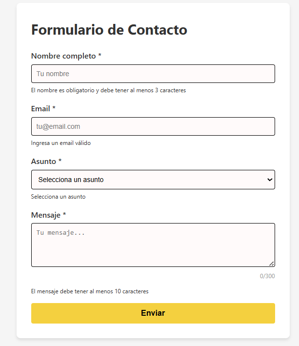
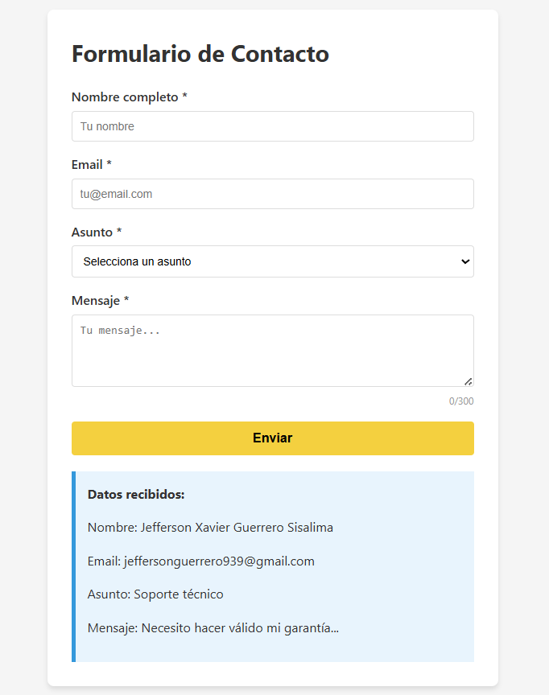
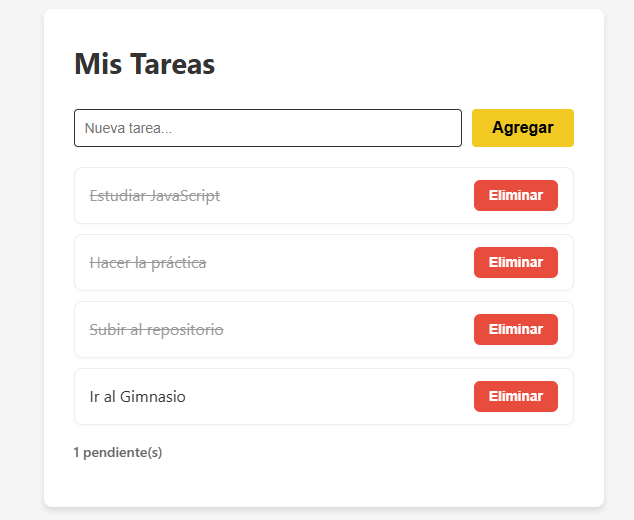

# Practica-03
Implementación de un sistema de validación de formularios y un gestor de tareas dinámico, donde se incluye:
* Validación de datos en tiempo real
* Manipulación del DOM para crear y eliminar elementos.
* Atajos de teclado 
### Código Destacado
```javascript
// Validación de formulario
formulario.addEventListener('submit', (e) => {
    e.preventDefault(); 

    const nombreValido = validarNombre();
    const emailValido = validarEmail();
    const asuntoValido = validarAsunto();
    const mensajeValido = validarMensaje();

    if (nombreValido && emailValido && asuntoValido && mensajeValido) {
        mostrarResultado();
        resetearFormulario();
        return; 
    }

    if (!nombreValido) {
        inputNombre.focus();
    } else if (!emailValido) {
        inputEmail.focus();
    } else if (!asuntoValido) {
        selectAsunto.focus();
    } else if (!mensajeValido) {
        textMensaje.focus();
    }
});
// Event Delegation en la lista de tareas
listaTareas.addEventListener('click', (e) => {
    const action = e.target.dataset.action; 
    const item = e.target.closest('li');    
    if (!action || !item) return;
    const id = Number(item.dataset.id);
    
    if (action === 'eliminar') {
        tareas = tareas.filter((tarea) => tarea.id !== id);
        renderizarTareas();
    }
   
    if (action === 'toggle') {
        const tarea = tareas.find((t) => t.id === id);
        if (tarea) {
            tarea.completada = !tarea.completada;
            renderizarTareas();
        }
    }
});
//Atajo de teclado 
document.addEventListener('keydown', (e) => {
    if (e.ctrlKey && e.key === 'Enter') {
        e.preventDefault(); 
        formulario.requestSubmit(); 
    }
});
```
### Capturas

**Validación**



---

**Formulario enviado**



---

**Event delegation**

s