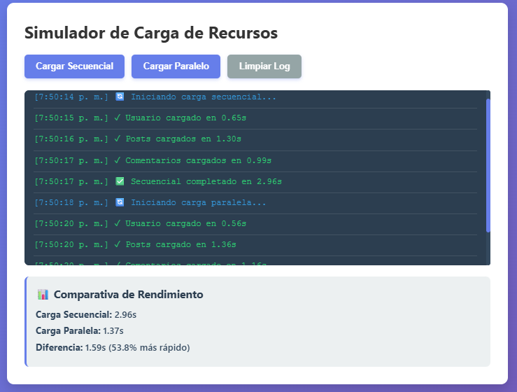
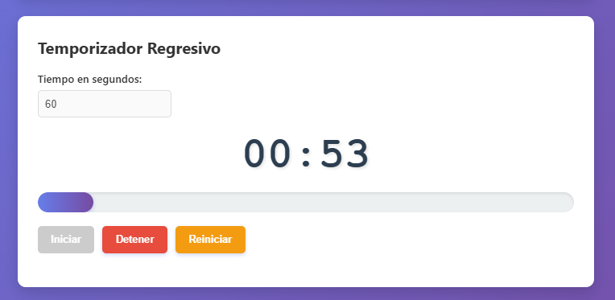
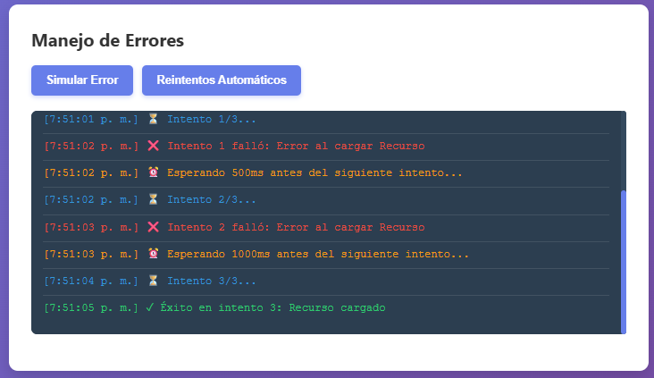

# Practica-05
El simulador implementado, simula peticiones a recursos como usuarios, posts y comentarios, utilizando promesas con setTimeout, mostrando los resultados en un log visual.También, incluye un temporizador regresivo con una barra de progreso y un módulo de manejo de errores. 
### Código destacado

```javascript
///Funcion que retorna una promesa
function simularPeticion(nombre, tiempoMin, tiempoMax, fallar = false) {
  return new Promise((resolve, reject) => {
    const tiempoDelay = Math.random() * (tiempoMax - tiempoMin) + tiempoMin;

    setTimeout(() => {
      if (fallar) {
        reject(new Error(`Error al cargar ${nombre}`));
      } else {
        resolve({ nombre, tiempo: tiempoDelay });
      }
    }, tiempoDelay);
  });
}

///Carga secuencial
const usuario = await simularPeticion('Usuario', 500, 1000);
const posts = await simularPeticion('Posts', 700, 1500);
const comentarios = await simularPeticion('Comentarios', 600, 1200);

///Carga paralela
const promesas = [
  simularPeticion('Usuario', 500, 1000),
  simularPeticion('Posts', 700, 1500),
  simularPeticion('Comentarios', 600, 1200)
];

const resultados = await Promise.all(promesas);

///Manejo de errores
try {
  await simularPeticion('API', 500, 1000, true);
} catch (error) {
  mostrarLogError(error.message, 'error');
}

///Temporizador con setInterval
intervaloId = setInterval(() => {
  tiempoRestante--;
  actualizarDisplay();

  if (tiempoRestante <= 0) {
    detener();
  }
}, 1000);


```
### Capturas

**1. Carga secuencial vs paralela**



**Descripción:** la carga secuencial tomó 2.96s (suma de delays individuales) mientras que la carga paralela tomó tomó 1.37s (el delay más largo), demostrando una diferencia de 1.59s entre una y otra, por lo tanto, la carga paralela resulta ser más veloz con un 53.8% 

---

**2. Temporizador Regresivo**



**Descripción:** temporizador de 60 segundos con barra de progreso actualizandose cada segundo

---

**3. Manejo de errores**



**Descripción:** Error capturado con try/catch y mostrado en la interfaz de usuario